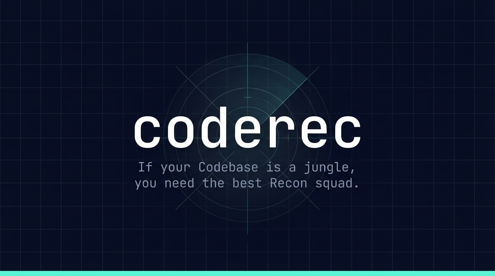
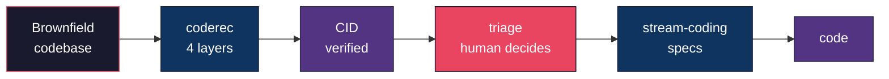
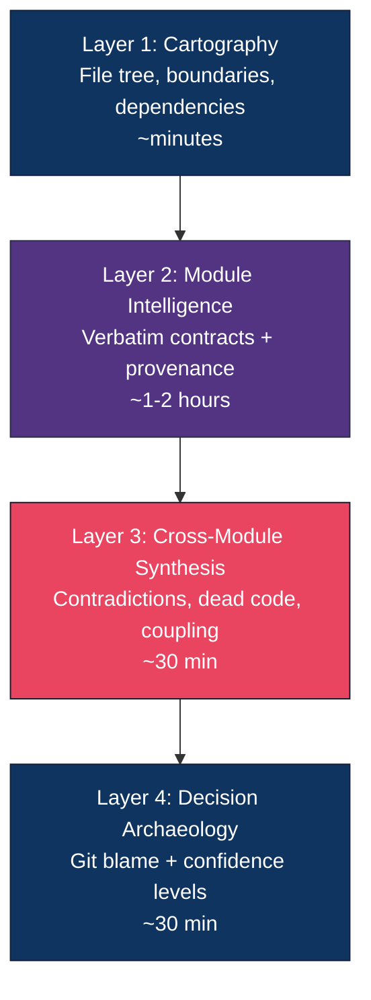
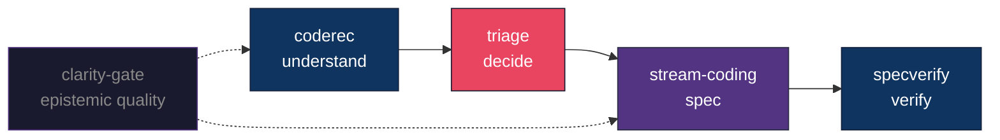

<!-- ============================================================
     VISUAL ASSET 1: HERO BANNER — CREATED (assets/banner.jpg)
     
     ACTUAL DESIGN:
     - Background: deep navy (#1a1f36) with fine tactical grid overlay
       (thin teal/cyan lines forming a precise square grid, ~3% opacity,
       evoking satellite imagery or military operations center screens)
     - Center-top: translucent radar/crosshair reticle graphic --
       concentric circles with 4 radial crosshair lines extending outward,
       subtle compass-rose aesthetic, rendered in muted teal/gray.
       A faint triangular "scan beam" sweeps upward from center,
       suggesting active reconnaissance in progress.
     - Center: "coderec" in wide-spaced monospace font, white (#ffffff),
       large (~80pt equivalent), clean lowercase, high readability.
       Slight text shadow for depth against the grid.
     - Below name: two-line tagline in lighter monospace, smaller (~18pt),
       muted off-white/gray (#b0bec5):
       "If your Codebase is a jungle,"
       "you need the best Recon squad."
     - Bottom edge: solid cyan/turquoise accent bar (#64ffda / #4de8b0),
       ~8px tall, spanning full width -- acts as a brand signature line
       and visual anchor.
     - Overall feel: military operations center / satellite recon UI.
       Professional, not gamery. Evokes "precision intelligence gathering."
     
     DIMENSIONS: ~1280x640 (2:1), JPEG.
     ============================================================ -->

<p align="center">
  
</p>

<p align="center">
  <a href="LICENSE"></a>
  <a href="https://www.npmjs.com/package/coderec"></a>
  <a href="https://pypi.org/project/coderec/"></a>
  <a href="https://github.com/frmoretto/coderec"></a>
  <a href="https://agentskills.io/"></a>
</p>

<p align="center">
  <a href="#what-happened">Story</a> &bull;
  <a href="#what-you-get">Output</a> &bull;
  <a href="#the-4-layers">Layers</a> &bull;
  <a href="#7-gates">Gates</a> &bull;
  <a href="#try-it">Try it</a> &bull;
  <a href="#real-results">Results</a> &bull;
  <a href="#ecosystem">Ecosystem</a>
</p>

---

## What happened

We asked an AI agent to document a production codebase (27,000 LOC, Next.js + Convex + Python) for regeneration via SDD.
It came back with a beautiful, detailed, confident report.

**It had 29 factual -and mostly critical- errors.**

-> <u>Wrong</u> file paths: it read from a rebuild directory, not production.
-> <u>Wrong</u> package versions: it used `npm latest` instead of the lockfile.
-> <u>Wrong</u> component interfaces: it described what it *remembered*, not what *existed*.
-> <u>Wrong</u> CSS values: it mixed two sources of truth.

We tried to fix it.
The agent re-read the codebase and produced a second report.
**6 errors survived.**

Same root cause: the agent didn't verify correctly  (or didn't verify at all) its own claims against the actual source code.

That's when we realized: the problem isn't the agent.
The problem is that **we didn't give the agent a procedure/protocol on how to map correctly the territory for an army of AI agents.**

## Why a normal analysis document isn't enough

You might think: "just ask an AI to analyze the codebase and write a report." We did. That's the report with 29 errors.

Let's make a quick parallel: it's 1999 (before GPS widespread adoption) and you're driving in the countryside. You're lost so you stop a local for directions: "turn left at the big tree, right after the gas station." It usually worked -- because you were driving slowly enough to notice when something looked wrong, stop, and ask again. The directions didn't need to be perfect because the human process corrected errors along the way.

Now we feed directions into automated systems. Self-driving cars. Route optimization. Fleet logistics. Suddenly "turn left at the big tree" kills people. The directions that were fine for a human driver at 30mph are catastrophic for an automated system at scale.
That's why GPS exists: not only because it's faster than asking a local, but because **automated systems need verified maps, not inferred directions.**

The same shift is happening in software right now. 
Here's why it works for humans but fails for pipelines:

**The human process has implicit fault protection.** A senior developer reads an architecture doc, and when something looks off -- "wait, wasn't that `16.1`, not `16.2`?" -- they open the file and check. They hold the document loosely. They treat it as a starting point, not as ground truth. Errors get caught along the way because the process is slow enough for humans to notice, question, and verify. The document doesn't need to be perfect because the human workflow corrects it incrementally.

**An automated pipeline has no such protection.** When you feed a document with info about your production software into any spec-generation tool (BMAD, GSD, Spec Kit, Stream Coding), it treats every claim as an axiom.

If the document says `Next.js 16.2`, then the spec says `Next.js 16.2`, and linearly the generated code targets `Next.js 16.2`. 
There is no "hmm, that doesn't look right" moment. 
There is no human in the loop between input and output.
The pipeline is internally consistent, and factually wrong. At scale. At speed. 
When in the end you realize the error, it's too late: software has been already (and wrongly) generated.

| | Human-driven process | Automated pipeline |
|--|---------------------|--------------------|
| Speed | Slow (days/weeks) | Fast (minutes/hours) |
| Error correction | Built-in: humans question, verify, cross-check | None: input is treated as axiom |
| Wrong claim | Gets caught eventually through review | **Gets propagated into specs, code, and production** |
| Document quality needed | "Good enough" -- humans fill the gaps | **Must be verified** -- no one fills the gaps |

A PRD, an architecture doc, a "here's how this works" report -- they're all fine for human consumption. But they're all unsuitable for automated consumption. Because automated pipelines turn unverified inputs into unverified outputs. Period.

**The verification gates are not a nice-to-have.** They replace the implicit fault protection that humans provide in a manual process. Every claim in a CID file is anchored to a specific `file:line` in the source, hashed for integrity, and checked by a gate before the CID is marked VALID. The gates are the human cross-check, formalized and automated.

Without that: you're automating on top of opinions.
With that: you're automating on top of evidence.

**coderec is the fix.**

> **Remember:
A human catches errors <u>sometimes</u>.
An automated pipeline propagates them <u>always</u>.**

```
coderec full --sot /path/to/your/codebase
```

It scans your codebase in 4 progressive layers, produces a **Codebase Intelligence Document (CID)**, and then *verifies every claim in that document against the actual source code* through 7 gates. The output isn't a summary. It's a verified artifact -- provenance-anchored, gate-checked, and machine-readable.

Full CID on a 27k LOC production app: **~2 hours with Claude Opus.** No install. No config. Just the skill and your codebase.

<!-- ============================================================
     VISUAL ASSET 2: PIPELINE FLOW
     File: assets/pipeline.svg (SVG preferred for crisp rendering)
     Dimensions: 900x200, horizontal layout
     
     DESIGN:
     - 6 boxes in a horizontal chain connected by arrows
     - Each box: rounded rectangle, dark fill, white text, ~120x80px
     - Arrow style: simple line with arrowhead, thin, gray or muted
     - Color scheme progresses left to right:
       Box 1 "Brownfield codebase" — dark red/coral border (#e94560)
       Box 2 "coderec (4 layers)"  — navy fill (#0f3460)
       Box 3 "CID (verified)"      — purple fill (#533483)
       Box 4 "triage (human)"      — coral fill (#e94560), this is the KEY box,
              slightly larger or highlighted to show "human decision point"
       Box 5 "stream-coding"       — navy fill (#0f3460)
       Box 6 "code"                — purple fill (#533483)
     - Below box 3: small label "what IS"
     - Below box 6: small label "what SHOULD BE"
     - Font: same monospace as banner
     - Dark background matching banner (#0a0e27) or transparent
     
     ALTERNATIVE: If the Mermaid diagram renders well on GitHub, keep
     the mermaid block below and skip this asset. Test on GitHub first.
     ============================================================ -->



## What you get

```
CID/
+-- system_map.md            What modules exist, how they connect
+-- modules/
|   +-- auth.md              Per-module: contracts, behavior, assumptions
|   +-- billing.md           Every claim has a source:line provenance anchor
|   \-- ...
+-- coherence_report.md      Contradictions, dead code, type gaps, duplication
+-- decision_register.md     Why things are the way they are (or "unknown")
+-- verification_status.md   7 gates -- all checked against source
\-- triage.md                Your decisions: FIX / ACCEPT / DEFER
```

<details>
<summary><strong>See a real system_map excerpt (from the 27k LOC test run)</strong></summary>

```markdown
## Module Boundaries

| Module      | Directory              | Responsibility                    | Files | LOC   | Confidence |
|-------------|------------------------|-----------------------------------|-------|-------|------------|
| convex      | convex/                | Backend: schema, queries, HTTP API| 12    | ~2970 | Medium     |
| dashboard   | src/app/dashboard/     | All dashboard pages               | 15    | ~2400 | Medium     |
| components  | src/components/        | Shared React components           | 21    | ~2500 | Medium     |
| pipeline    | skill/scripts/         | Python pipeline scripts           | 23    | ~8790 | High       |
| lib         | src/lib/ + hooks/      | Shared utilities, hooks, contexts | 11    | ~380  | Medium     |

## Communication Patterns

| From              | To            | Mechanism                      |
|-------------------|---------------|--------------------------------|
| src/* (frontend)  | convex        | Convex React hooks             |
| skill/scripts     | convex/http   | HTTP REST (Bearer token)       |
| src/middleware     | Next.js       | Hostname-based routing         |
| Stripe            | convex/http   | Webhook POST                   |
```

</details>

<details>
<summary><strong>See real verification gates (all 7 passing)</strong></summary>

```markdown
| Gate | Name                 | Checked | Pass | Fail | Result   |
|------|----------------------|---------|------|------|----------|
| 1    | Path Verification    | 22      | 22   | 0    | PASS     |
| 2    | Version Verification | 18      | 18   | 0    | PASS     |
| 3    | Contract Verification| 15      | 15   | 0    | PASS     |
| 4    | Schema Verification  | 5       | 5    | 0    | PASS     |
| 5    | CSS Token Verify     | 13      | 13   | 0    | PASS     |
| 6    | Behavior Verify      | 21      | 21   | 0    | PASS     |
| 7    | Cross-Reference      | 17      | 17   | 0    | PASS     |

CID STATUS: VALID
```

</details>

### CID is not a spec

|  | CID (coderec) | Spec (your SDD tool) |
|--|---------------|---------------------|
| **Says** | "the system does X" | "the system shall do X" |
| **Type gaps** | "field uses `any`" | "field shall use `string`" |
| **Dead code** | "this export has 0 callers" | "delete it" or "keep it" |
| **Decisions** | "inferred from git blame" | "ratified by CTO" |

> coderec observes. It does **not** prescribe.

## The 4 layers

<!-- ============================================================
     VISUAL ASSET 3: LAYERS DIAGRAM
     File: assets/layers.svg
     Dimensions: 500x400, vertical stack
     
     DESIGN:
     - 4 stacked rounded rectangles, top to bottom, with arrows between
     - Each rectangle: ~400x70px, slightly overlapping or connected by
       downward arrow
     - Content per box (left-aligned text + right-aligned time estimate):
       [1] "Cartography"              "~minutes"
           "boundaries, dependencies"
       [2] "Module Intelligence"      "~1-2 hours"
           "verbatim contracts"
       [3] "Cross-Module Synthesis"   "~30 min"
           "contradictions, dead code"
       [4] "Decision Archaeology"     "~30 min"
           "git blame, confidence"
     - Color: same navy/purple/coral palette as pipeline
     - Left side: numbers 1-4 in circles
     - Right side: time estimates in muted gray
     - Below the stack: small text "Each layer compacts context for the next"
     - Arrow between boxes: shows data flow (system_map -> cards -> report -> register)
     
     This replaces the Mermaid diagram below if it looks better as SVG.
     ============================================================ -->



Each layer compacts context for the next. Code is read once per module, not dumped wholesale.

## 7 gates

The CID is derived -- it can be wrong. So we verify it.

<!-- ============================================================
     VISUAL ASSET 4: GATES TABLE
     File: assets/gates.svg
     Dimensions: 800x350
     
     DESIGN:
     - 7 horizontal rows, each representing a gate
     - Left column: gate number in a circle (1-7)
     - Middle: gate name + what it checks (one line each)
     - Right: status badge
       - INVALID gates (1,3,6,7): red/coral badge
       - DEGRADED gates (2,4,5): amber/yellow badge
     - Below the 7 rows: a thin separator, then:
       - "Secret scan" with a lock icon
       - "SOT revalidation" with a refresh icon
     - Bottom: 4 status badges in a row:
       VALID (green)  DEGRADED (amber)  STALE (gray)  INVALID (red)
     - Background: dark or transparent
     - Font: monospace
     
     This is the "wow" visual -- it shows the rigor at a glance.
     If this single image exists, it replaces the code block below.
     ============================================================ -->

```
Gate 1  Path         Every file path resolves against source     INVALID if wrong
Gate 2  Version      Versions match the lock file                DEGRADED if wrong
Gate 3  Contract     Export signatures match source:line         INVALID if wrong
Gate 4  Schema       Types match source exactly                  DEGRADED if wrong
Gate 5  CSS          Tokens match theme/globals                  DEGRADED if wrong
Gate 6  Behavior     Render logic, routing, metadata match       INVALID if wrong
Gate 7  Cross-ref    All CID files agree with each other         INVALID if wrong
```

Plus: **secret scan** (pre-step) and **SOT revalidation** (did the code change while we were scanning?).

**Status:** `VALID` . `DEGRADED` . `STALE` . `INVALID`

> `INVALID` = hard stop. Don't feed this to your spec tool.

## Try it

**No install needed.** coderec is a protocol, not a binary. Load the skill into any AI agent and go.

**Full reconnaissance** (~2 hours for 27k LOC):
```
coderec full --sot /path/to/your/codebase
```
Load [`skill/SKILL.md`](skill/SKILL.md) into Claude Code, Codex, or any agent that reads skill files.

**Scoped** (just one area and its dependencies):
```
coderec scope src/auth --sot /path/to/codebase
```

**Quick map** (Layer 1 only, minutes):
```
coderec cartography --sot /path/to/codebase
```

**Placeholder CLI** (full CLI coming soon):
```bash
npx coderec
```

<!-- ============================================================
     VISUAL ASSET 5: TERMINAL SCREENSHOT
     File: assets/terminal.png (or animated GIF/SVG)
     Dimensions: 800x500
     
     DESIGN:
     - A realistic terminal window (dark background, title bar with dots)
     - Shows the output of running `coderec full`:
     
       $ coderec full --sot /home/user/my-app
       
       coderec v0.1.0
       SOT_ROOT: /home/user/my-app
       COMMIT_SHA: 96eebf0
       Working tree: clean
       
       [Layer 1] Cartography.............. 22 modules identified
       [Layer 2] Module Intelligence...... 11 cards (11 CARD, 11 SKIPPED)
       [Layer 3] Cross-Module Synthesis... 44 findings
       [Layer 4] Decision Archaeology..... 27 decisions
       
       [Gate 1] Path............. PASS  (22/22)
       [Gate 2] Version......... PASS  (18/18)
       [Gate 3] Contract........ PASS  (15/15)
       [Gate 4] Schema.......... PASS  (5/5)
       [Gate 5] CSS............. PASS  (13/13)
       [Gate 6] Behavior........ PASS  (21/21)
       [Gate 7] Cross-ref....... PASS  (17/17)
       
       CID STATUS: VALID
       Output: CID/
     
     - Color coding:
       - "PASS" in green
       - Gate numbers in cyan
       - "VALID" in bright green, bold
       - "coderec" in cyan (matching the npm output)
       - Layer lines use dots as progress indicator
     - Terminal font: monospace (same as banner)
     - This is the MOST IMPORTANT visual asset -- it's what makes
       someone say "I want to try this." Like Repomix's screenshot
       showing output pasted into ChatGPT.
     
     ANIMATED ALTERNATIVE: A 5-second GIF or APNG showing the
     layers appearing one by one, then gates checking one by one,
     ending with "CID STATUS: VALID" appearing in green.
     This would be extremely compelling but harder to produce.
     ============================================================ -->

## Real results

Battle-tested on a production Next.js + Convex + Python app (27k LOC, 22 modules, 8 Convex tables, 19 HTTP endpoints, Python pipeline with 23 scripts).

<!-- ============================================================
     VISUAL ASSET 6: RESULTS CARD
     File: assets/results.svg
     Dimensions: 600x250
     
     DESIGN:
     - Dark card with rounded corners, subtle border
     - 4 stats in a 2x2 grid, each with a large number and small label:
       Top-left:  "VALID"  (large, green) / "CID Status" (small, gray)
       Top-right: "7/7"    (large, green) / "Gates passed" (small, gray)
       Bot-left:  "44"     (large, cyan)  / "Findings surfaced" (small, gray)
       Bot-right: "29->0"  (large, coral) / "Errors eliminated" (small, gray)
     - Below the grid: one line in muted text:
       "12 adversarial review passes across 3 AI models"
     - Style: like a GitHub stats card or a Vercel deployment summary
     - Background: same dark navy or transparent with border
     ============================================================ -->

| Metric | Result |
|--------|--------|
| CID Status | **VALID** -- all 7 gates passed |
| Findings surfaced | **44** (contradictions, dead code, type gaps) |
| Specs generated from triage | **7** actionable specs |
| Original 29 errors that would recur | **0** |

Built through **12 adversarial review passes** across 3 AI models. Each pass attacked the design. Each flaw was fixed.

## When to use it

**Yes:**
- Introducing SDD into a legacy project -- CID is Phase 0
- Need a shared, trustworthy map across teams (architecture, product, QA)
- Want AI agents to stop hallucinating about your code
- Onboarding new developers -- CID beats tribal knowledge
- Auditing a codebase you didn't write

**No:**
- Small repo you already understand completely
- Pure greenfield with clean specs

## Ecosystem

<!-- ============================================================
     VISUAL ASSET 7: ECOSYSTEM DIAGRAM
     File: assets/ecosystem.svg
     Dimensions: 700x300
     
     DESIGN:
     - Horizontal flow of 4 primary tools as rounded boxes, connected by arrows:
       [coderec] --> [triage] --> [stream-coding] --> [specverify]
     - Below each box, a one-word role:
       "understand"   "decide"    "spec"          "verify"
     - Clarity Gate as a dashed-border box sitting above/below the flow,
       connected to coderec and stream-coding with dotted lines
       (cross-cutting concern, not in the main flow)
     - Color scheme: same as pipeline diagram
     - Below the diagram: text "Works with Spec Kit, OpenSpec, or your own SDD tool"
     - Font: monospace, matching overall brand
     - The "triage" box should be visually distinct (coral/red fill)
       because it's the HUMAN step -- the only box that isn't an automated tool
     
     NOTE: If this is too similar to VISUAL ASSET 2, merge them.
     The pipeline diagram (asset 2) shows the data flow;
     the ecosystem diagram (asset 7) shows the tool landscape.
     If they feel redundant, keep only one -- probably asset 2
     since it appears earlier and is more important.
     ============================================================ -->



The CID is **framework-agnostic** -- works with Spec Kit, OpenSpec, Stream Coding, or your own SDD tool. MIT license -- use it in client engagements, commercial products, anything.

| Tool | Does | Link |
|------|------|------|
| **coderec** | Understand your codebase | This repo |
| [specverify](https://github.com/frmoretto/specverify) | Verify your specs | frmoretto/specverify |
| [Stream Coding](https://github.com/frmoretto/stream-coding) | Write your specs | frmoretto/stream-coding |
| [Clarity Gate](https://github.com/frmoretto/clarity-gate) | Epistemic quality | frmoretto/clarity-gate |

## CID Schema

Machine-readable contract for tool integration:

```bash
node schema/validate-cid.mjs path/to/cid.json
```

See [`schema/`](schema/) for JSON Schema, example fixture, and validator.

## Philosophy: one tool, one job

We learned this the hard way.

Our first attempt was one AI agent doing everything: understand the codebase, document it, verify the docs, and generate specs. It produced 29 errors. The agent couldn't do reconnaissance and generation in the same pass -- it cut corners on understanding because it was eager to produce output.

So we split it. Spec verification used to be a paragraph inside Stream Coding. It was mediocre. The moment we pulled it out into its own tool ([specverify](https://github.com/frmoretto/specverify)), it became rigorous. Same thing happened with epistemic quality -- it was a checklist inside Stream Coding, now it's [Clarity Gate](https://github.com/frmoretto/clarity-gate) with 9 verification points.

coderec follows the same principle. It does **one thing**: understand your codebase and prove that understanding is correct. It doesn't write specs. It doesn't refactor code. It doesn't make decisions. Those are other tools' jobs.

The result: five focused tools that compose into a pipeline, each doing one thing well.

```
coderec       ->  understand  (one job)
triage        ->  decide      (human job)
stream-coding ->  spec        (one job)
specverify    ->  verify      (one job)
clarity-gate  ->  epistemic   (one job)
```

Every time we tried to merge two of these, quality dropped. Every time we split them apart, quality jumped. The architecture is the lesson.

## Prior art

coderec builds on SAR research, AI doc generators (CodeWiki, KT Studio), enterprise tools (EPAM ART, Augment), and SDD frameworks (Spec Kit, OpenSpec, DocDD). What's new: **layered analysis + verified artifact + standard schema + SDD handoff** in one open protocol.

## Roadmap

| | Status |
|-|--------|
| Protocol + templates + 7 gates | **Done** |
| 12 adversarial passes, 3 models | **Done** |
| CID JSON Schema + validator | **Done** |
| Real-world test (VALID CID) | **Done** |
| npm + PyPI namespace | **Done** |
| CLI tool + MCP server | Planned |
| Triage dashboard | Planned |

## Compatibility

Follows the [Agent Skills format](https://agentskills.io/) and works with Claude Code, Cursor, Windsurf, Cline, and other compatible agents.

## Contributing

- **Test it** -- Run coderec on your brownfield codebase and tell us what breaks
- **Extend it** -- Language support beyond JS/TS/Python/Go/Rust/Java
- **Build gates** -- Tooling that automates the 7-gate verification

---

<p align="center">
  MIT . <a href="https://github.com/frmoretto">Francesco Marinoni Moretto</a> . <a href="https://stream-coding.com">stream-coding.com</a>
</p>
