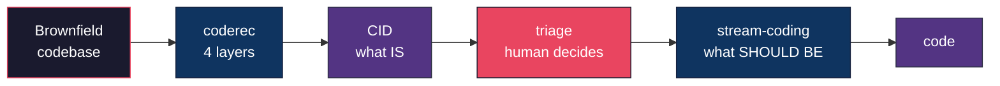
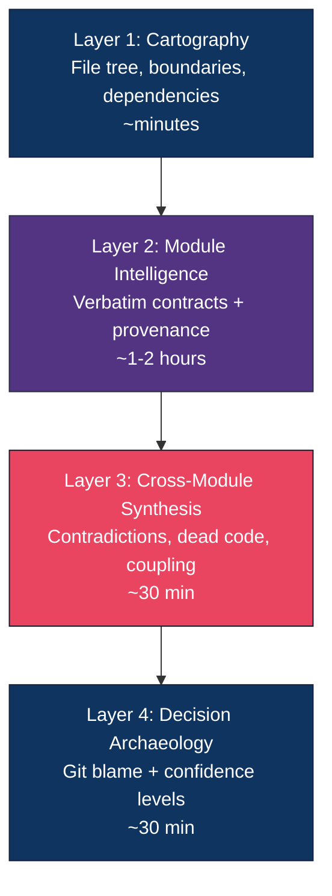
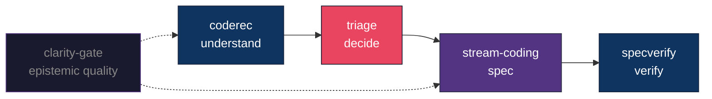

<p align="center">
  
</p>

<p align="center">
  <a href="LICENSE"></a>
  <a href="https://www.npmjs.com/package/coderec"></a>
  <a href="https://pypi.org/project/coderec/"></a>
  <a href="https://agentskills.io/"></a>
</p>

<p align="center">
  <a href="#what-happened">Story</a> &bull;
  <a href="#what-you-get">Output</a> &bull;
  <a href="#the-4-layers">Layers</a> &bull;
  <a href="#7-gates">Gates</a> &bull;
  <a href="#try-it">Try it</a> &bull;
  <a href="#real-results">Results</a> &bull;
  <a href="#ecosystem">Ecosystem</a>
</p>

---

## What happened

We asked an AI agent to document a production codebase (27,000 LOC, Next.js + Convex + Python) for regeneration via SDD. It came back with a beautiful, detailed, confident report.

**It had 29 factual errors.**

Wrong file paths (read from a rebuild directory, not production). Wrong package versions (`npm latest` instead of the lockfile). Wrong component interfaces (described what it *remembered*, not what *existed*). Wrong CSS values (mixed two sources of truth).

We told the agent to re-read the codebase and fix them. **6 errors survived.** Same root cause: the agent didn't verify its own claims against the actual source code.

**coderec is the fix.**

```
coderec full --sot /path/to/your/codebase
```

It scans your codebase in 4 progressive layers, produces a **Codebase Intelligence Document (CID)**, and then *verifies every claim in that document against the actual source code* through 7 gates.

The CID is a **map**, not a plan — it tells you what *is*, not what *should be*. The output isn't a summary. It's a verified artifact — provenance-anchored, gate-checked, and machine-readable.

Full CID on a 27k LOC production app: **~45 minutes with Claude Opus.** No install. No config. Just the skill and your codebase.



---

## What you get

```
CID/
+-- system_map.md            What modules exist, how they connect
+-- modules/
|   +-- auth.md              Per-module: contracts, behavior, assumptions
|   +-- billing.md           Every claim has a source:line provenance anchor
|   \-- ...
+-- coherence_report.md      Contradictions, dead code, type gaps, duplication
+-- decision_register.md     Why things are the way they are (or "unknown")
+-- verification_status.md   7 gates -- all checked against source
\-- triage.md                Your decisions: FIX / ACCEPT / DEFER
```

<details>
<summary><strong>See a real system_map excerpt (from the 27k LOC test run)</strong></summary>

```markdown
## Module Boundaries

| Module      | Directory              | Responsibility                    | Files | LOC   | Confidence |
|-------------|------------------------|-----------------------------------|-------|-------|------------|
| convex      | convex/                | Backend: schema, queries, HTTP API| 12    | ~2970 | Medium     |
| dashboard   | src/app/dashboard/     | All dashboard pages               | 15    | ~2400 | Medium     |
| components  | src/components/        | Shared React components           | 21    | ~2500 | Medium     |
| pipeline    | skill/scripts/         | Python pipeline scripts           | 23    | ~8790 | High       |
| lib         | src/lib/ + hooks/      | Shared utilities, hooks, contexts | 11    | ~380  | Medium     |

## Communication Patterns

| From              | To            | Mechanism                      |
|-------------------|---------------|--------------------------------|
| src/* (frontend)  | convex        | Convex React hooks             |
| skill/scripts     | convex/http   | HTTP REST (Bearer token)       |
| src/middleware     | Next.js       | Hostname-based routing         |
| Stripe            | convex/http   | Webhook POST                   |
```

</details>

<details>
<summary><strong>See real verification gates (all 7 passing)</strong></summary>

```markdown
| Gate | Name                 | Checked | Pass | Fail | Result   |
|------|----------------------|---------|------|------|----------|
| 1    | Path Verification    | 22      | 22   | 0    | PASS     |
| 2    | Version Verification | 18      | 18   | 0    | PASS     |
| 3    | Contract Verification| 15      | 15   | 0    | PASS     |
| 4    | Schema Verification  | 5       | 5    | 0    | PASS     |
| 5    | CSS Token Verify     | 13      | 13   | 0    | PASS     |
| 6    | Behavior Verify      | 21      | 21   | 0    | PASS     |
| 7    | Cross-Reference      | 17      | 17   | 0    | PASS     |

CID STATUS: VALID
```

</details>

### A CID is a photograph, not a blueprint

A CID documents what your codebase **does** — not what it **should** do. It's a verified map of the territory. The moment you start deciding what to fix, keep, or change, you've left the map and entered spec territory. That's a different tool's job.

|  | CID (the map) | Spec (the plan) |
|--|---------------|---------------------|
| **Says** | "the system does X" | "the system shall do X" |
| **Type gaps** | "field uses `any`" | "field shall use `string`" |
| **Dead code** | "this export has 0 callers" | "delete it" or "keep it" |
| **Decisions** | "inferred from git blame" | "ratified by CTO" |

> coderec photographs your codebase. It does **not** prescribe what to do with what it finds.

---

## The 4 layers



Each layer compacts context for the next. Code is read once per module, not dumped wholesale.

---

## 7 gates

The CID is derived — it can be wrong. So we verify it.

```
Gate 1  Path         Every file path resolves against source     INVALID if wrong
Gate 2  Version      Versions match the lock file                DEGRADED if wrong
Gate 3  Contract     Export signatures match source:line         INVALID if wrong
Gate 4  Schema       Types match source exactly                  DEGRADED if wrong
Gate 5  CSS          Tokens match theme/globals                  DEGRADED if wrong
Gate 6  Behavior     Render logic, routing, metadata match       INVALID if wrong
Gate 7  Cross-ref    All CID files agree with each other         INVALID if wrong
```

Plus: **secret scan** (pre-step) and **SOT revalidation** (did the code change while we were scanning?).

**Status:** `VALID` . `DEGRADED` . `STALE` . `INVALID`

> `INVALID` = hard stop. Don't feed this to your spec tool.

---

## Try it

**No install needed.** coderec is a protocol, not a binary. Load the skill into any AI agent and go.

**Full reconnaissance** (~45 min for 27k LOC):
```
coderec full --sot /path/to/your/codebase
```
Load [`skill/SKILL.md`](skill/SKILL.md) into Claude Code, Codex, or any agent that reads skill files.

**Scoped** (just one area and its dependencies):
```
coderec scope src/auth --sot /path/to/codebase
```

**Quick map** (Layer 1 only, minutes):
```
coderec cartography --sot /path/to/codebase
```

---

## Real results

Tested end-to-end on a production Next.js + Convex + Python app (27k LOC, 22 modules, 8 Convex tables, 19 HTTP endpoints, Python pipeline with 23 scripts).

| Metric | Result |
|--------|--------|
| CID Status | **VALID** — all 7 gates passed |
| Findings surfaced | **44** (contradictions, dead code, type gaps) |
| Specs generated from triage | **7** actionable specs |
| Original 29 errors that would recur | **0** |

Built through **12 adversarial review passes** across 3 AI models. Each pass attacked the design. Each flaw was fixed.

---

## Why verified maps matter

You might think: "just ask an AI to analyze the codebase and write a report." We did. That's the report with 29 errors.

It's like GPS replacing "turn left at the big tree." Those directions worked when a human was driving slowly enough to notice when something looked wrong, stop, and ask again. But feed those same directions into an automated system — self-driving cars, fleet logistics — and "turn left at the big tree" kills people. **Automated systems need verified maps, not inferred directions.**

The same shift is happening in software. A senior developer reads an architecture doc, and when something looks off — "wait, wasn't that `16.1`, not `16.2`?" — they open the file and check. An automated pipeline has no such instinct. Feed a document into any spec-generation tool (BMAD, GSD, Spec Kit, Stream Coding), and it treats every claim as an axiom. The pipeline is internally consistent, and factually wrong.

| | Human-driven process | Automated pipeline |
|--|---------------------|--------------------|
| Speed | Slow (days/weeks) | Fast (minutes/hours) |
| Error correction | Built-in: humans question, verify, cross-check | None: input is treated as axiom |
| Wrong claim | Gets caught eventually through review | **Gets propagated into specs, code, and production** |
| Document quality needed | "Good enough" — humans fill the gaps | **Must be verified** — no one fills the gaps |

The verification gates replace the implicit fault protection that humans provide. Every claim in a CID is anchored to a specific `file:line` in the source, hashed for integrity, and checked by a gate before the CID is marked VALID.

Without that: you're automating on top of opinions.
With that: you're automating on top of evidence.

> **A human catches errors sometimes. An automated pipeline propagates them always.**

---

## Philosophy: one tool, one job

We learned this the hard way.

Our first attempt was one AI agent doing everything: understand the codebase, document it, verify the docs, and generate specs. It produced 29 errors. The agent couldn't do reconnaissance and generation in the same pass — it cut corners on understanding because it was eager to produce output.

So we split it. Spec verification used to be a paragraph inside Stream Coding. It was mediocre. The moment we pulled it out into its own tool ([specverify](https://github.com/frmoretto/specverify)), it became rigorous. Same thing happened with epistemic quality — it was a checklist inside Stream Coding, now it's [Clarity Gate](https://github.com/frmoretto/clarity-gate) with 9 verification points.

coderec follows the same principle. It does **one thing**: understand your codebase and prove that understanding is correct. It doesn't write specs. It doesn't refactor code. It doesn't make decisions. Those are other tools' jobs.

Every time we tried to merge two of these, quality dropped. Every time we split them apart, quality jumped. The architecture is the lesson.

---

## Ecosystem



| Tool | Does | Link |
|------|------|------|
| **coderec** | Understand your codebase | This repo |
| [specverify](https://github.com/frmoretto/specverify) | Verify your specs | frmoretto/specverify |
| [Stream Coding](https://github.com/frmoretto/stream-coding) | Write your specs | frmoretto/stream-coding |
| [Clarity Gate](https://github.com/frmoretto/clarity-gate) | Epistemic quality | frmoretto/clarity-gate |

The CID is **framework-agnostic** — works with Spec Kit, OpenSpec, Stream Coding, or your own SDD tool. MIT license — use it in client engagements, commercial products, anything.

## CID Schema

Machine-readable contract for tool integration:

```bash
node schema/validate-cid.mjs path/to/cid.json
```

See [`schema/`](schema/) for JSON Schema, example fixture, and validator.

## When to use it

**Yes:**
- Introducing SDD into a legacy project — CID is Phase 0
- Need a shared, trustworthy map across teams (architecture, product, QA)
- Want AI agents to stop hallucinating about your code
- Onboarding new developers — CID beats tribal knowledge
- Auditing a codebase you didn't write

**No:**
- Small repo you already understand completely
- Pure greenfield with clean specs

## Prior art

coderec builds on SAR research, AI doc generators (CodeWiki, KT Studio), enterprise tools (EPAM ART, Augment), and SDD frameworks (Spec Kit, OpenSpec, DocDD). What's new: **layered analysis + verified artifact + standard schema + SDD handoff** in one open protocol.

## Roadmap

| | Status |
|-|--------|
| Protocol + templates + 7 gates | **Done** |
| 12 adversarial passes, 3 models | **Done** |
| CID JSON Schema + validator | **Done** |
| Real-world test (VALID CID) | **Done** |
| npm + PyPI namespace | **Done** |
| CLI tool + MCP server | Planned |
| Triage dashboard | Planned |

## Compatibility

Follows the [Agent Skills format](https://agentskills.io/) and works with Claude Code, Cursor, Windsurf, Cline, and other compatible agents.

## Contributing

- **Test it** — Run coderec on your brownfield codebase and tell us what breaks
- **Extend it** — Language support beyond JS/TS/Python/Go/Rust/Java
- **Build gates** — Tooling that automates the 7-gate verification

---

<p align="center">
  MIT . <a href="https://github.com/frmoretto">Francesco Marinoni Moretto</a> . <a href="https://stream-coding.com">stream-coding.com</a>
</p>
